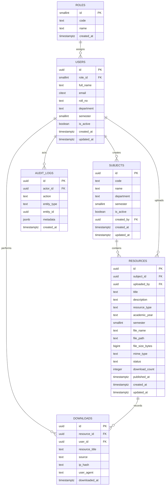

# DATABASE DESIGN

This document is the canonical reference for the current Supabase database schema for CMRIT Vault.

Use this file to verify schema assumptions in backend, mobile, and future web code before adding or changing queries.

## Schema Overview

| Table | Purpose |
|---|---|
| `roles` | Canonical role lookup table |
| `users` | Auth-linked user profile table |
| `subjects` | Academic subject catalog |
| `resources` | Notes, question papers, and faculty uploads |
| `downloads` | Download audit trail |
| `audit_logs` | Admin and moderation audit trail |

## Core Design Rules

| Rule | Meaning |
|---|---|
| Role model is normalized | User role is stored via `users.role_id`, not `users.role` |
| `roles.code` is the app-facing role string | `student`, `faculty`, `admin` |
| API-facing role must be derived | Backend should join `users.role_id -> roles.id` and expose `roles.code` as `role` |
| `users.id` matches `auth.users.id` | Same UUID as Supabase Auth user |
| Files are private | Storage bucket is private and accessed through signed URLs |
| `resources` is the central content table | It stores notes, question papers, and faculty uploads |
| `downloads` tracks access only | No business logic should depend on it for authorization |

## `roles`

| Column | Type | Constraints / Notes |
|---|---|---|
| `id` | smallint identity | Primary key |
| `code` | text | Unique, values: `student`, `faculty`, `admin` |
| `name` | text | Display label |
| `created_at` | timestamptz | Default `now()` |

### Seed Data

| code | name |
|---|---|
| `student` | `Student` |
| `faculty` | `Faculty` |
| `admin` | `Admin` |

## `users`

| Column | Type | Constraints / Notes |
|---|---|---|
| `id` | uuid | Primary key, FK to `auth.users(id)` |
| `role_id` | smallint | FK to `roles(id)` |
| `full_name` | text | Required |
| `email` | citext | Unique, required |
| `roll_no` | text | Unique, optional |
| `department` | text | Optional |
| `semester` | smallint | Optional, allowed 1 to 8 |
| `is_active` | boolean | Default `true` |
| `created_at` | timestamptz | Default `now()` |
| `updated_at` | timestamptz | Default `now()`, maintained by trigger |

### Indexes

| Index | Purpose |
|---|---|
| `idx_users_role_id` | Role-based filtering |
| `idx_users_department` | Department filtering |
| `idx_users_semester` | Semester filtering |

### Constraints

| Constraint | Purpose |
|---|---|
| `users_semester_chk` | Semester must be null or between 1 and 8 |

## User Role Resolution

| Query Pattern | Expected Use |
|---|---|
| `users.role_id -> roles.id` | Source of truth |
| `roles.code` | App-facing role string |
| `users.role` | Not part of this schema contract |

## `subjects`

| Column | Type | Constraints / Notes |
|---|---|---|
| `id` | uuid | Primary key |
| `code` | text | Unique, required |
| `name` | text | Required |
| `department` | text | Required |
| `semester` | smallint | Required, 1 to 8 |
| `is_active` | boolean | Default `true` |
| `created_by` | uuid | FK to `users(id)`, nullable |
| `created_at` | timestamptz | Default `now()` |
| `updated_at` | timestamptz | Default `now()`, maintained by trigger |

### Seed Data

| code | name | department | semester |
|---|---|---|---|
| `CSE101` | `Programming in C` | `CSE` | 1 |
| `MAT101` | `Engineering Mathematics` | `CSE` | 1 |
| `CSE201` | `Data Structures` | `CSE` | 3 |
| `ECE201` | `Digital Electronics` | `ECE` | 3 |
| `CSE301` | `Database Management Systems` | `CSE` | 5 |

### Indexes

| Index | Purpose |
|---|---|
| `idx_subjects_department_semester` | Filter by department and semester |
| `idx_subjects_is_active` | Active subject lookup |

## `resources`

| Column | Type | Constraints / Notes |
|---|---|---|
| `id` | uuid | Primary key |
| `subject_id` | uuid | FK to `subjects(id)` |
| `uploaded_by` | uuid | FK to `users(id)` |
| `title` | text | Required |
| `description` | text | Optional |
| `resource_type` | text | Required, one of `note`, `question_paper`, `faculty_upload` |
| `academic_year` | text | Required, example `2024-2025` |
| `semester` | smallint | Required, 1 to 8 |
| `file_name` | text | Required |
| `file_path` | text | Unique, required |
| `file_size_bytes` | bigint | Required, must be > 0 |
| `mime_type` | text | Required |
| `status` | text | Default `draft`, one of `draft`, `pending_review`, `published`, `rejected`, `archived` |
| `download_count` | integer | Default `0` |
| `published_at` | timestamptz | Nullable |
| `created_at` | timestamptz | Default `now()` |
| `updated_at` | timestamptz | Default `now()`, maintained by trigger |

### Constraints

| Constraint | Purpose |
|---|---|
| `resources_type_chk` | Enforces valid resource types |
| `resources_status_chk` | Enforces valid resource states |
| `resources_semester_chk` | Semester must be between 1 and 8 |
| `resources_size_chk` | File size must be positive |

### Indexes

| Index | Purpose |
|---|---|
| `idx_resources_subject_id` | Subject filtering |
| `idx_resources_uploaded_by` | Owner filtering |
| `idx_resources_resource_type` | Resource type filtering |
| `idx_resources_status` | Publication state filtering |
| `idx_resources_academic_year` | Academic year filtering |
| `idx_resources_created_at` | Recency sorting |
| `idx_resources_published_lookup` | Fast published-resource lookup |

### File Path Convention

| Pattern | Meaning |
|---|---|
| `resources/{resource_type}/{resource_id}/{file_name}` | Canonical storage path |

## `downloads`

| Column | Type | Constraints / Notes |
|---|---|---|
| `id` | uuid | Primary key |
| `resource_id` | uuid | FK to `resources(id)` |
| `user_id` | uuid | FK to `users(id)` |
| `resource_title` | text | Snapshot title at download time |
| `source` | text | Default `mobile`, one of `mobile`, `web`, `admin` |
| `ip_hash` | text | Optional privacy-safe audit field |
| `user_agent` | text | Optional audit field |
| `downloaded_at` | timestamptz | Default `now()` |

### Indexes

| Index | Purpose |
|---|---|
| `idx_downloads_resource_id` | Resource download history |
| `idx_downloads_user_id` | User download history |
| `idx_downloads_downloaded_at` | Recent downloads |
| `idx_downloads_user_downloaded_at` | User-specific recent downloads |

## `audit_logs`

| Column | Type | Constraints / Notes |
|---|---|---|
| `id` | uuid | Primary key |
| `actor_id` | uuid | FK to `users(id)`, `ON DELETE SET NULL` to preserve history |
| `action` | text | Required, audit action name |
| `entity_type` | text | Required, target entity type |
| `entity_id` | uuid | Required, target entity UUID |
| `metadata` | jsonb | Optional structured context |
| `created_at` | timestamptz | Default `now()` |

### Indexes

| Index | Purpose |
|---|---|
| `idx_audit_logs_actor_id` | Actor drill-down |
| `idx_audit_logs_entity_type_entity_id` | Entity drill-down |
| `idx_audit_logs_action` | Action-based filtering |
| `idx_audit_logs_created_at_desc` | Recent-first timelines |
| `idx_audit_logs_actor_created_at_desc` | Actor timeline views |
| `idx_audit_logs_entity_created_at_desc` | Entity timeline views |
| `idx_audit_logs_action_created_at_desc` | Action timeline views |

## Row Level Security

| Table | RLS Policy Model |
|---|---|
| `roles` | Readable by authenticated users; writable by admin only |
| `users` | Self read/write plus admin access |
| `subjects` | Readable by authenticated users; writable by admin only |
| `resources` | Public-to-auth logic via authenticated role checks and ownership |
| `downloads` | Self read plus admin access; insert only when resource is viewable |
| `audit_logs` | Admin read only; backend service role handles writes |

## Helper Functions

| Function | Purpose |
|---|---|
| `set_updated_at()` | Maintains `updated_at` on update |
| `is_admin()` | Checks if the current user is an active admin |
| `is_faculty()` | Checks if the current user is an active faculty member |
| `can_view_resource(resource_id)` | Verifies whether the current user can access a resource |

## Storage

| Item | Value |
|---|---|
| Bucket name | `cmrit-vault-files` |
| Visibility | Private |
| Access pattern | Signed upload URLs and signed download URLs only |

## Contract Expectations for Code

| Code Should Expect | Do Not Assume |
|---|---|
| `users.role_id` + `roles.code` | `users.role` |
| `users.full_name` | `users.name` |
| `subjects.code`, `subjects.name`, `subjects.department`, `subjects.semester` | Extra subject columns unless explicitly added later |
| `resources.resource_type` and `resources.status` as text enums | Separate tables for notes/papers/uploads in MVP |
| `downloads.resource_title` snapshot | Join-time title only |

## ER Diagram

## API Contract

All endpoints use the standard envelope:

| Field | Meaning |
|---|---|
| `success` | Boolean success flag |
| `message` | Human-readable summary |
| `data` | Payload |
| `error` | Error details when `success = false` |

### Auth

| Method | URL | Access | Purpose | Core Request | Core Response |
|---|---|---|---|---|---|
| `POST` | `/v1/auth/sync` | Authenticated | Sync Supabase user into `users` table | No body; uses JWT from `Authorization` header | `{ user }` |

### Users

| Method | URL | Access | Purpose | Core Request | Core Response |
|---|---|---|---|---|---|
| `GET` | `/v1/users/me` | Authenticated | Return current user profile | No body | `{ user }` |
| `PATCH` | `/v1/users/me` | Authenticated | Update own profile | Partial profile fields | `{ user }` |
| `GET` | `/v1/admin/users` | Admin | List users | Query params: pagination, role, department, semester | `{ items, pageInfo }` |
| `GET` | `/v1/admin/users/:id` | Admin | Get user detail | Path `id` | `{ user }` |
| `PATCH` | `/v1/admin/users/:id/role` | Admin | Update role | `{ role }` or `{ role_id }` depending implementation | `{ user }` |
| `PATCH` | `/v1/admin/users/:id/status` | Admin | Activate/deactivate user | `{ is_active }` | `{ user }` |

### Subjects

| Method | URL | Access | Purpose | Core Request | Core Response |
|---|---|---|---|---|---|
| `GET` | `/v1/subjects` | Authenticated | List subjects | Query params: department, semester, search, pagination | `{ items, pageInfo }` |
| `GET` | `/v1/subjects/:id` | Authenticated | Get subject detail | Path `id` | `{ subject }` |
| `POST` | `/v1/admin/subjects` | Admin | Create subject | `{ code, name, department, semester }` | `{ subject }` |
| `PATCH` | `/v1/admin/subjects/:id` | Admin | Update subject | Partial subject fields | `{ subject }` |
| `DELETE` | `/v1/admin/subjects/:id` | Admin | Disable subject | No body | `{ subject }` |

### Resources

| Method | URL | Access | Purpose | Core Request | Core Response |
|---|---|---|---|---|---|
| `GET` | `/v1/resources` | Authenticated | List visible resources | Filters: subjectId, semester, department, resourceType, academicYear, status, pagination | `{ items, pageInfo }` |
| `GET` | `/v1/resources/:id` | Authenticated | Get resource detail | Path `id` | `{ resource }` |
| `POST` | `/v1/resources` | Faculty/Admin | Create draft resource metadata | Upload metadata | `{ resource, uploadSession }` |
| `PATCH` | `/v1/resources/:id` | Owner/Admin | Update resource metadata | Partial resource fields | `{ resource }` |
| `POST` | `/v1/resources/:id/complete` | Owner/Admin | Mark upload complete | No body | `{ resource }` |
| `POST` | `/v1/resources/:id/submit` | Owner/Admin | Submit for review/publish | Optional review note | `{ resource }` |
| `DELETE` | `/v1/resources/:id` | Owner/Admin | Archive resource | No body | `{ resource }` |
| `PATCH` | `/v1/admin/resources/:id/status` | Admin | Moderate resource | `{ status }` | `{ resource }` |

### Downloads

| Method | URL | Access | Purpose | Core Request | Core Response |
|---|---|---|---|---|---|
| `POST` | `/v1/resources/:id/download-url` | Authenticated | Create signed download URL and log download | Optional client context | `{ downloadUrl, expiresAt }` |
| `GET` | `/v1/downloads/me` | Authenticated | List own downloads | Query params: pagination, date range, resourceType, subjectId | `{ items, pageInfo }` |
| `GET` | `/v1/admin/downloads` | Admin | Audit downloads | Query params: pagination, userId, resourceId, date range | `{ items, pageInfo }` |

### Faculty Dashboard

| Method | URL | Access | Purpose | Core Request | Core Response |
|---|---|---|---|---|---|
| `GET` | `/v1/faculty/dashboard/summary` | Faculty/Admin | Dashboard metrics | Optional period filter | `{ summary }` |
| `GET` | `/v1/faculty/resources` | Faculty/Admin | List own uploads | Filters + pagination | `{ items, pageInfo }` |
| `GET` | `/v1/faculty/resources/:id/stats` | Owner/Admin | Resource stats | Path `id` | `{ stats }` |

### Search

| Method | URL | Access | Purpose | Core Request | Core Response |
|---|---|---|---|---|---|
| `GET` | `/v1/search/resources` | Authenticated | Search resources through Algolia | `q`, filters, pagination | `{ items, pageInfo }` |
| `GET` | `/v1/search/suggest` | Authenticated | Suggestions/autocomplete | `q`, `limit` | `{ items }` |
| `POST` | `/v1/admin/search/reindex` | Admin | Reindex search data | `scope`, optional `resourceId` | `{ jobId, status }` |
| `POST` | `/v1/admin/search/resources/:id/reindex` | Admin | Reindex one resource | Path `id` | `{ jobId, status }` |

## API Contract Notes

| Rule | Meaning |
|---|---|
| Authentication | Supabase JWT must be sent in `Authorization: Bearer <token>` |
| Role in responses | API should expose role as a string code, derived from `roles.code` |
| Uploads | File upload should use private storage and signed URLs |
| Downloads | File download should use signed URLs and always log download events |
| Search | Algolia is read-optimized only and must never be treated as source of truth for authorization |

## Schema Evolution Rules

| Rule | Meaning |
|---|---|
| Preserve normalized roles | Continue using `users.role_id` and `roles.code` as the only role contract |
| Derive, do not duplicate | If the API needs a role string, map it from `roles.code`; do not add `users.role` |
| Keep content centralized | New content types should extend `resources` unless there is a strong domain reason to split tables |
| Keep storage private | All new files must remain behind signed URLs in the private bucket |
| Maintain backward-compatible API shape | If a response field is already consumed by mobile/web, preserve it when possible |
| Add columns intentionally | Any new nullable column should have a documented use case and default behavior |

## Change Management Rules

| Rule | Meaning |
|---|---|
| Update schema and code together | Any DB schema change must be reflected in backend repositories and API contracts |
| Update this file first | Treat `DATABASE_DESIGN.md` as the canonical design source before implementation |
| Never introduce contradictory role fields | Do not add `users.role` alongside `users.role_id` |
| Validate relationships before release | Confirm foreign keys, RLS policies, and indexes after each schema change |
| Keep API response mapping explicit | Document how each API field is derived from schema fields |
| Prefer migrations over ad-hoc edits | All schema changes should be captured in migrations and documented here |
