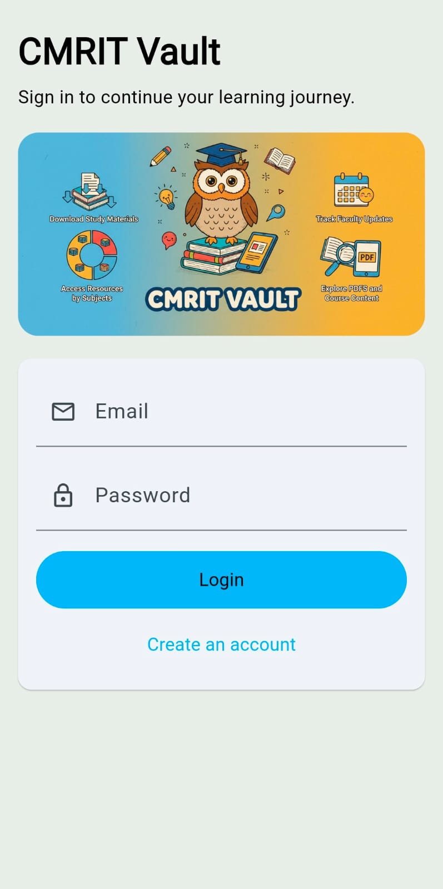
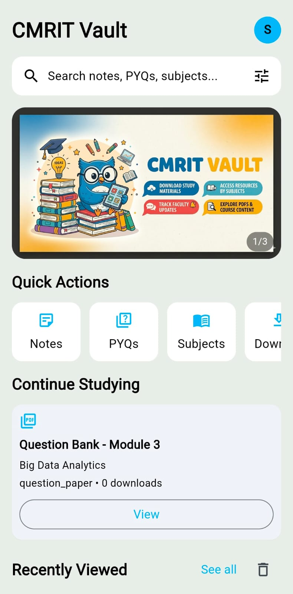
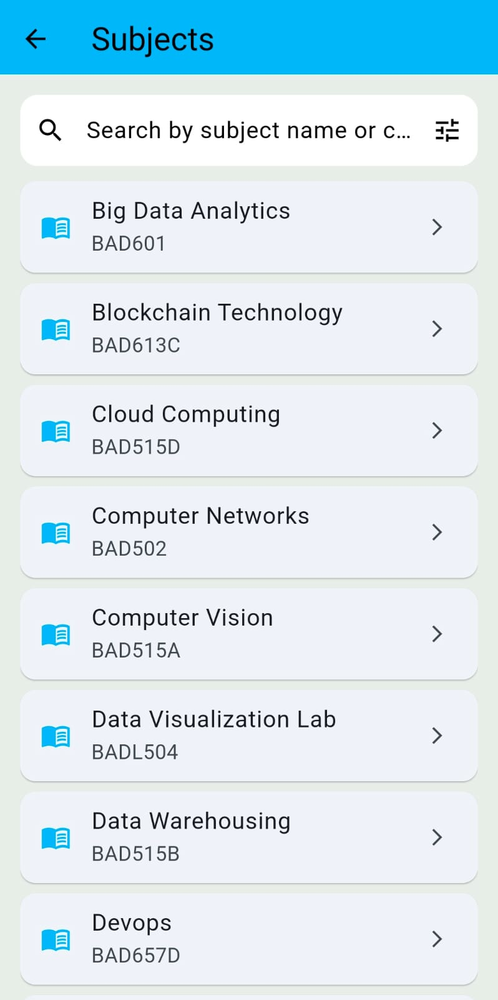
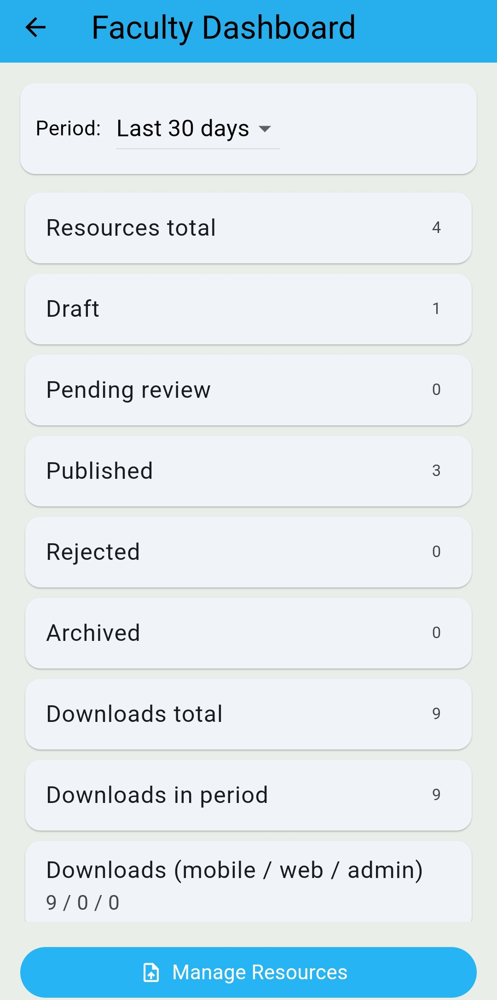
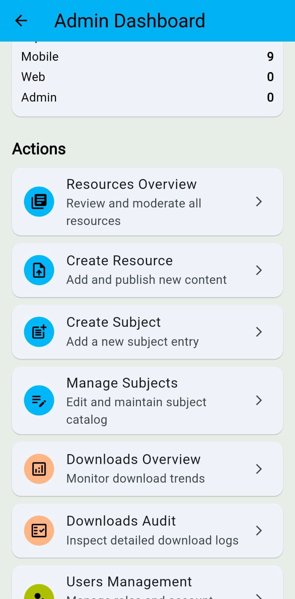

# CMRIT Vault

[](#tech-stack)
[](#tech-stack)
[](#tech-stack)
[](#tech-stack)
[](#monitoring)

CMRIT Vault is a full-stack mobile platform for academic resource management with role-aware workflows:

- Faculty upload and submit resources.
- Admins moderate and approve/reject.
- Students browse, search, and download verified content.

## Table of Contents

- [Project Overview](#project-overview)
- [Features](#features)
- [Tech Stack](#tech-stack)
- [Architecture Overview](#architecture-overview)
- [Screenshots](#screenshots)
- [Installation and Setup](#installation-and-setup)
- [Environment Variables](#environment-variables)
- [API Overview](#api-overview)
- [Deployment](#deployment)
- [Security Features](#security-features)
- [Monitoring](#monitoring)
- [Future Improvements](#future-improvements)
- [Contributing](#contributing)
- [License](#license)

## Project Overview

CMRIT Vault centralizes notes, PDFs, and academic files in one controlled pipeline. The backend is server-authoritative for secure uploads/downloads, and the mobile app is built for production with strict runtime config and release monitoring.

## Features

- Authentication with Supabase token verification.
- Role-based access control (`student`, `faculty`, `admin`).
- Faculty upload workflow with submit/complete states.
- Admin moderation and status transitions.
- Student discovery via subjects, search, and suggestions.
- Secure signed download URL generation.
- Per-surface rate limiting and request tracing.

## Tech Stack

- Mobile: Flutter (Dart)
- Backend: Node.js, Express, TypeScript, Zod
- Data and Storage: Supabase
- Search: Algolia
- Monitoring: Sentry
- Hosting: Render (backend)

## Architecture Overview

### Backend

- Entry points: `backend/src/server.ts`, `backend/src/app.ts`
- API base: `/v1`
- Modules: `auth`, `users`, `subjects`, `resources`, `downloads`, `search`, `faculty`, `admin`
- Flow: `routes -> controller -> service -> integrations`

Production middleware in use:

- `helmet` for headers
- production-aware CORS allowlist
- scoped rate limiters (`global`, `auth`, `upload`, `download`, `admin`)
- request ID + structured logging
- centralized not-found and error handling

### Mobile

- Structure under `mobile/lib`: `app`, `core`, `features`
- REST communication with backend `/v1/*`
- release guardrails for `API_BASE_URL` (`https://` required)
- environment and release tracking through `--dart-define`

## Screenshots

Replace placeholders with actual images (recommended path: `docs/screenshots/`).

| Screen | Preview |
|---|---|
| Login |  |
| Student Home |  |
| Resource Details |  |
| Faculty Upload |  |
| Admin Moderation |  |

## Installation and Setup

### Prerequisites

- Node.js 20+
- npm 9+
- Flutter 3.x
- Supabase project
- Algolia app/index

### Backend

```bash
cd backend
npm install
npm run dev
```

Production start:

```bash
cd backend
npm run build
npm start
```

### Mobile

```bash
cd mobile
flutter pub get
flutter run --dart-define=API_BASE_URL=http://10.0.2.2:4000 --dart-define=APP_ENV=development
```

Checks:

```bash
cd mobile
flutter analyze
flutter test
```

## Environment Variables

### Backend (`backend/.env`)

Required:

```env
PORT=4000
NODE_ENV=development
SUPABASE_URL=https://<project>.supabase.co
SUPABASE_SERVICE_ROLE_KEY=<service-role-key>
```

Security and limits:

```env
APP_ALLOWED_ORIGINS=http://localhost:3000,http://localhost:5173
ALLOW_MISSING_ORIGIN=true
GLOBAL_RATE_LIMIT_WINDOW_MS=900000
GLOBAL_RATE_LIMIT_MAX=600
AUTH_RATE_LIMIT_WINDOW_MS=900000
AUTH_RATE_LIMIT_MAX=30
UPLOAD_RATE_LIMIT_WINDOW_MS=900000
UPLOAD_RATE_LIMIT_MAX=40
DOWNLOAD_RATE_LIMIT_WINDOW_MS=900000
DOWNLOAD_RATE_LIMIT_MAX=120
ADMIN_RATE_LIMIT_WINDOW_MS=900000
ADMIN_RATE_LIMIT_MAX=120
UPLOAD_BUCKET=cmrit-vault-files
UPLOAD_MAX_BYTES=26214400
ALLOWED_UPLOAD_MIME_TYPES=application/pdf,image/png,image/jpeg
REQUEST_TIMEOUT_MS=8000
REQUEST_RETRY_COUNT=2
REQUEST_RETRY_BASE_DELAY_MS=200
```

Integrations:

```env
ALGOLIA_APP_ID=<app-id>
ALGOLIA_SEARCH_KEY=<search-key>
ALGOLIA_ADMIN_KEY=<admin-key>
ALGOLIA_INDEX_NAME=<index-name>
ALGOLIA_SEARCH_HOST=<optional>
ALGOLIA_ADMIN_HOST=<optional>
SENTRY_DSN=<optional-backend-dsn>
```

### Mobile (`--dart-define`)

```bash
--dart-define=API_BASE_URL=https://api.example.com
--dart-define=APP_ENV=production
--dart-define=APP_VERSION=1.0.0+1
--dart-define=SENTRY_DSN=https://<public-key>@o0.ingest.sentry.io/0
```

`API_BASE_URL` is required in release mode and must be HTTPS.

## API Overview

Base URL: `https://<domain>/v1`

Core groups:

- Health: `GET /health`
- Auth: `POST /auth/sync`
- Users: `GET/PATCH /users/me`
- Subjects: `GET /subjects`, `GET /subjects/:id`
- Resources: list/detail/create/update/submit/complete/archive
- Downloads: `POST /resources/:id/download-url`, `GET /downloads/me`
- Search: `GET /search/resources`, `GET /search/suggest`
- Faculty: dashboard + owned resources + stats
- Admin: dashboard, moderation, user/subject/search/download controls

### API Examples

Auth sync:

```bash
curl -X POST "https://<domain>/v1/auth/sync" \
  -H "Authorization: Bearer <supabase-access-token>" \
  -H "Content-Type: application/json" \
  -d "{}"
```

Search resources:

```bash
curl "https://<domain>/v1/search/resources?q=operating+systems&page=1&limit=20" \
  -H "Authorization: Bearer <supabase-access-token>"
```

Create secure download URL:

```bash
curl -X POST "https://<domain>/v1/resources/<resource-id>/download-url" \
  -H "Authorization: Bearer <supabase-access-token>" \
  -H "Content-Type: application/json" \
  -d '{"device":"android"}'
```

Sample response envelope:

```json
{
  "success": true,
  "message": "OK",
  "data": {},
  "error": null
}
```

## Deployment

### Backend (Render)

1. Set Root Directory to `backend`.
2. Build Command: `npm install && npm run build`
3. Start Command: `npm start`
4. Add required environment variables.
5. Set `NODE_ENV=production` and a strict CORS allowlist.
6. Verify health at `GET /health`.

### Mobile (Flutter Release)

```bash
cd mobile
flutter build apk --release \
  --dart-define=API_BASE_URL=https://cmrit-vault-app.onrender.com \
  --dart-define=APP_ENV=production \
  --dart-define=APP_VERSION=1.0.0 \
  --dart-define=SENTRY_DSN=https://<public-key>@o0.ingest.sentry.io/0
```

Use the same define set for iOS release builds.

## Security Features

- Supabase token validation on protected routes
- RBAC for student/faculty/admin scopes
- Zod validation for body/query/params
- granular rate limiters per abuse surface
- Helmet security headers
- production CORS allowlist checks
- request ID tracing and centralized error handling
- signed URL flow without exposing privileged keys

## Monitoring

- Backend Sentry initialization when `SENTRY_DSN` is present
- Mobile Sentry configured through `--dart-define`
- Environment tags via `APP_ENV` and release tags via `APP_VERSION`

## Future Improvements

- Offline caching for frequent student/faculty views
- Push notifications for moderation and uploads
- CI/CD for backend deploy + mobile artifacts
- Expanded integration and E2E test coverage

## Contributing

1. Create a branch: `git checkout -b feat/<name>`
2. Keep commits focused and descriptive
3. Run checks before PR:
   - Backend: `npm run lint && npm test`
   - Mobile: `flutter analyze && flutter test`
4. Open a PR with scope, risk, and test notes

## License

No `LICENSE` file is present yet. Until added, treat this repository as proprietary.
